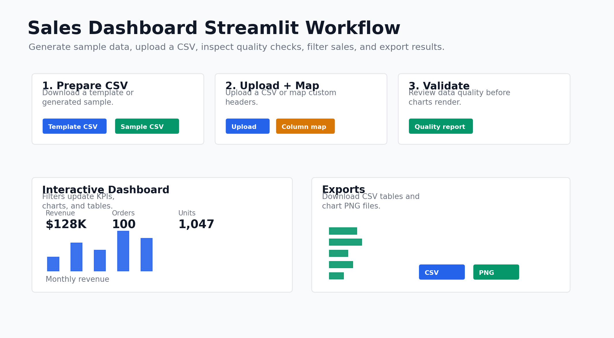

# Sales Dashboard

A Python data project that turns a sales CSV into a static dashboard with summary metrics, trend charts, and product performance tables.

The point of this build is to make raw sales records easier to understand quickly. Instead of reading rows in a spreadsheet, the script validates the data, calculates the most useful sales metrics, and produces a clean report that can be opened in any browser.



## Stack

- Python
- pandas
- matplotlib
- Streamlit
- unittest

## Features

- Validates required CSV fields before analysis.
- Reports data quality issues before dashboard validation.
- Calculates total revenue, total orders, units sold, average order value, and top product.
- Builds monthly revenue trends, top product rankings, category mix, and regional revenue charts.
- Generates a responsive `index.html` report.
- Exports filtered rows, summary tables, and dashboard charts from the interactive app.
- Provides in-app downloads for a blank CSV template and generated sample data.
- Includes unit tests for loading, validation, and core analytics.

## Project Structure

```text
.
|-- src/
|   |-- config/
|   |-- models/
|   |-- services/
|   `-- utils/
|-- data/
|   `-- sample_sales.csv
|-- docs/
|   |-- DEPLOYMENT.md
|   `-- assets/
|-- .github/
|   `-- workflows/
|-- .streamlit/
|   `-- config.toml
|-- scripts/
|   `-- create_readme_assets.py
|-- tests/
|   `-- test_sales_dashboard.py
|-- sales_dashboard.py
|-- generate_sales_csv.py
|-- streamlit_app.py
|-- CHANGELOG.md
|-- .env.example
|-- requirements.txt
|-- .gitignore
`-- README.md
```

## CSV Format

The dashboard expects these columns:

| Column | Description |
| --- | --- |
| `order_date` | Date of the sale. |
| `order_id` | Unique order identifier. |
| `product` | Product name. |
| `category` | Product category. |
| `region` | Sales region. |
| `quantity` | Units sold. |
| `unit_price` | Price per unit. |

An optional `revenue` column can be provided. If it is missing, revenue is calculated as `quantity * unit_price`.

## Environment Variables

No environment variables are required for the current version. See `.env.example` for the current template.

## Setup

```powershell
python -m venv .venv
.\.venv\Scripts\Activate.ps1
pip install -r requirements.txt
```

## Running Locally

Generate the static dashboard:

```powershell
python sales_dashboard.py
```

The generated dashboard will be written to:

```text
reports/sales_dashboard/index.html
```

To use a custom CSV:

```powershell
python sales_dashboard.py --csv path\to\sales.csv --output reports\custom_dashboard --top-n 10
```

Run the interactive dashboard:

```powershell
streamlit run streamlit_app.py
```

Generate random sales data for upload testing:

```powershell
python generate_sales_csv.py
```

Control the number of generated rows:

```powershell
python generate_sales_csv.py --rows 100
```

Generate repeatable test data:

```powershell
python generate_sales_csv.py --rows 100 --seed 42
```

Generate a blank fill-in CSV template:

```powershell
python generate_sales_csv.py --blank-template
```

## Testing

```powershell
python -m unittest discover -s tests
```

## Automated Checks

GitHub Actions runs the test workflow on branch pushes and pull requests to `main`. The workflow installs dependencies, runs the unit tests, and generates the static dashboard to confirm the command-line build still works.

## Deployed

Not deployed yet.

For Streamlit hosting, use:

```text
Main file: streamlit_app.py
Requirements: requirements.txt
```

The app does not require environment variables or secrets.

See `docs/DEPLOYMENT.md` for the deployment checklist and post-deploy validation steps.

## Architecture Notes

The build is split into small modules so each part has one job. CSV validation lives in the data loader, sales calculations live in the analysis service, chart rendering lives in the charts service, exports live in the export service, filtering lives in a small component helper, and report creation lives in the report service. The root `sales_dashboard.py` file stays small so it only starts the command-line workflow.

This structure makes the project easier to test and easier to extend. The Streamlit app reuses the same validation, data quality, filtering, analysis, and chart code as the static report instead of creating a separate dashboard implementation.

## Notes

- The generated `reports/` folder is ignored by Git because it is build output.
- The sample CSV is included so the dashboard can run immediately after dependencies are installed.
- A working Python installation is required before setup commands can run.

## Changelog

See `CHANGELOG.md`.

## Next Iteration Suggestions

- Add the deployed app URL once hosting is complete.
